# Дипломный проект курса «Библиотека React»

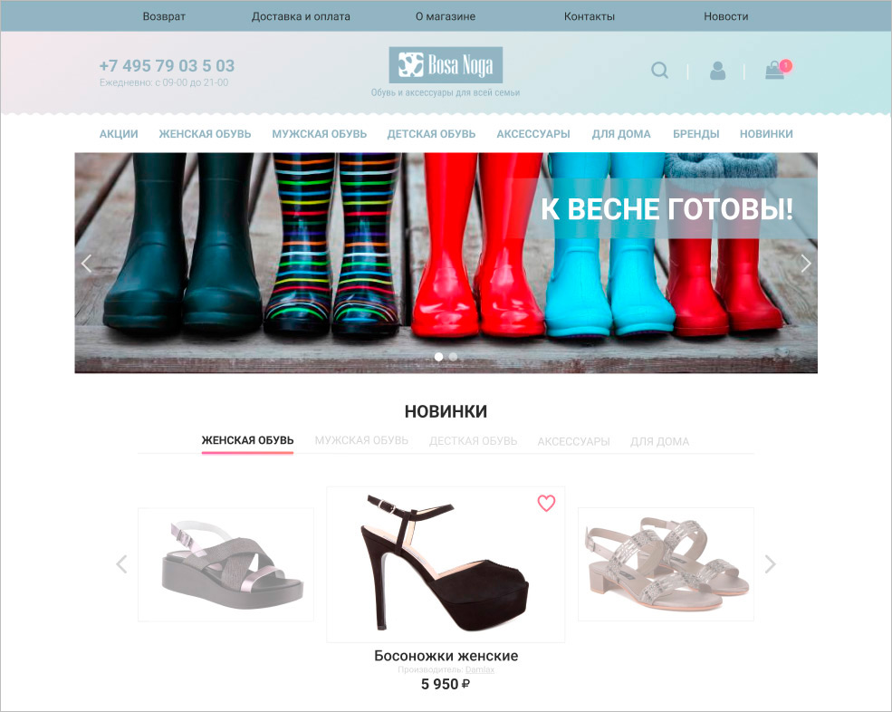

Дипломный проект представляет собой интернет-магазин обуви. Задача заключается в создании работающего приложения, всеми основными функциями которого можно пользоваться.

## Содержание

Приложение содержит следующие самостоятельные экраны (страницы):

+ Главная страница;
+ Каталог товаров;
+ Избранное;
+ Страница товара;
+ Оформление заказа.

И встроенные (являющиеся частью самостоятельных) экраны:
+ Товар;
+ Корзина покупок;
+ Поиск;
+ Подписка.

## Переходы между экранами

Навигационным центром приложения является шапка каждого экрана (страницы). Из шапки можно попасть на все основные экраны:

+ в **Каталог товаров**  
Кликнув по любой из ссылок в нижней части шапки, а затем выбрав одну из подкатегорий в открывшемся меню;
+ в **Избранное**  
Кликнув по иконке профиля в шапке, затем по ссылке «Избранное»;
+ в **Корзину покупок**  
Кликнув по иконке корзины;
+ на **Главную страницу**  
Кликнув по логотипу.

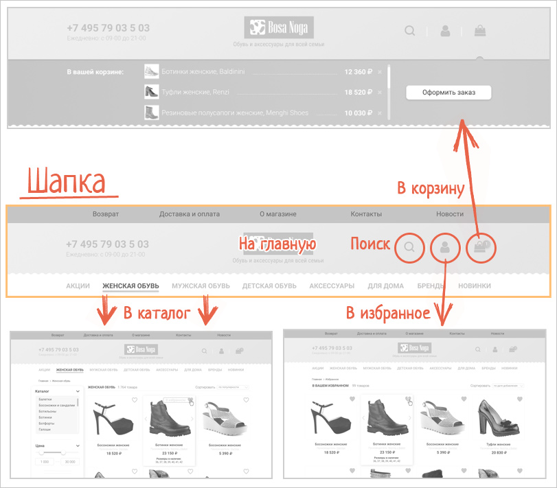

С большинства экранов можно попасть на экран «Страница товара», кликнув по названию или фотографии товара:

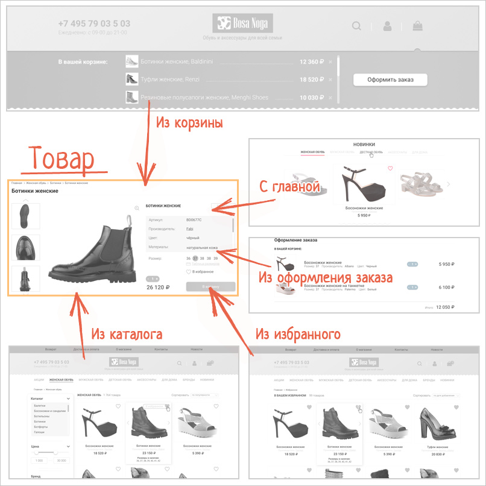

Единственным экраном, на который нельзя попасть откуда угодно, является экран «Оформление заказа». Перейти к этому экрану можно только из Корзины покупок, кликнув по кнопке «Оформить заказ»:

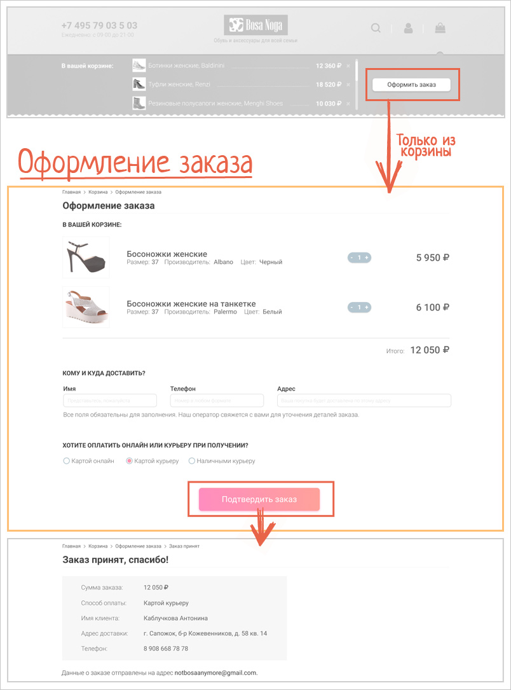

## Описание экранов

### Главная страница

Экран «Главная страница» доступен по умолчанию при открытии приложения.

[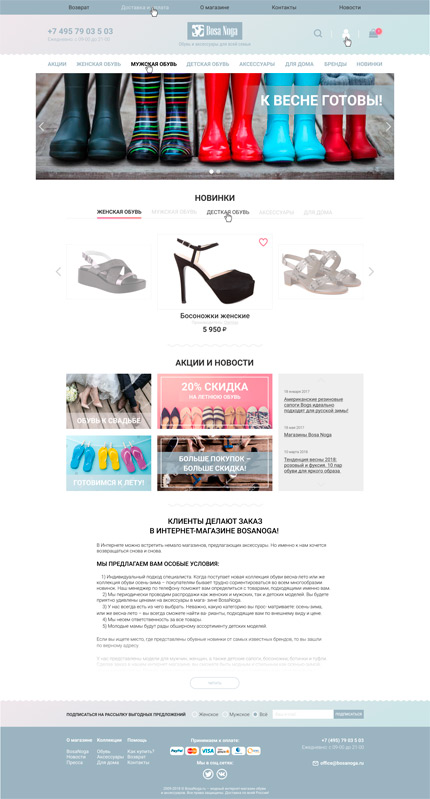](./resources/main.png) [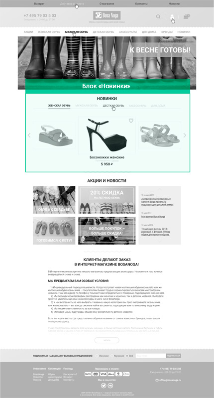](./resources/images/des-desktop-full.jpg)

Этот экран содержит, в основном, описания акций и новостей, которые для нас не представляют особого интереса. 

Реализовать на этом экране нужно блок «Новинки»:

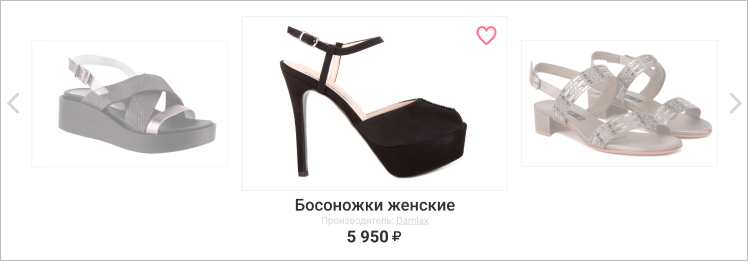

В блоке должны быть доступны возможности:
1. **Посмотреть все новинки**.  
Товары листаются с помощью стрелок вправо и влево бесконечно, т.е. при листании вперед после последнего товара отображается первый, соответственно, при листании назад после первого отображается последний.
2. **Добавить товар / товары в Избранное**  
Для добавления нужно кликнуть на сердечко в правом верхнем углу активного товара. При добавлении сердечко становится закрашенным.
3. **Убрать товар / товары из Избранного, если он был добавлен ранее**  
Чтобы убрать товар из избранного, нужно повторно кликнуть на сердечко. После этого сердечко снова становится белым.
4. **Перейти на страницу товара**  
Переход происходит по клику.

Получение списка новинок подробно описывается в разделе «Рекомендации по технической реализации» данного описания.

### Каталог товаров

На экран «Каталог товаров» можно попасть с любого самостоятельного экрана, кликнув по одной из ссылок в шапке страницы, а затем выбрав подкатегорию в выпадающем меню.

#### Выпадающее меню

Выпадающее меню открывается при клике на одну из ссылок в шапке страницы. В выпадающем меню должны быть отображены доступные подкатегории обуви.

[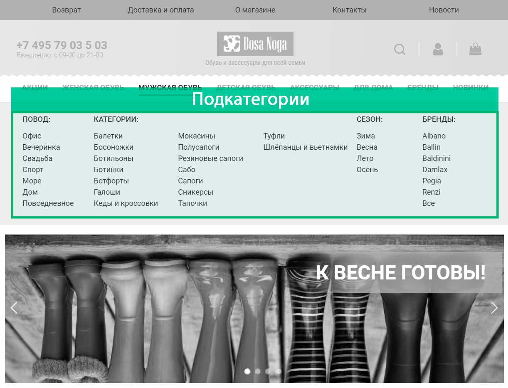](./resources/subcategories.png)

На экране «Каталог товаров» должны быть отображены все доступные товары в выбранной категории и выбранной подкатегории. Например, если пользователь кликнул на ссылку «Мужская обувь», затем на ссылку «Туфли», то на экране должны быть отображены все мужские туфли.

[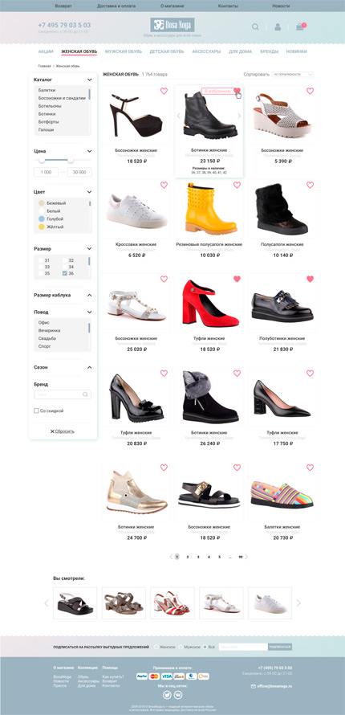](./resources/catalog.png) [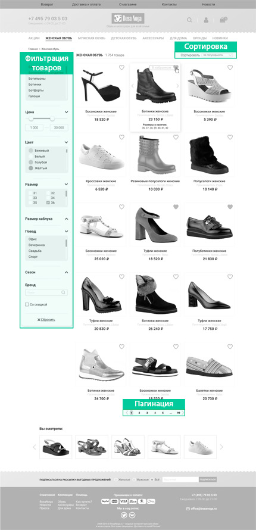](./resources/images/des-cat-full.jpg)

Товары отображаются постранично, на одной странице **15** товаров. 

В отношении каждого из товаров доступны возможности, аналогичные таковым на главной странице:
1. **Добавить товар / товары в Избранное**  
Для добавления нужно кликнуть на сердечко в правом верхнем углу активного товара. При добавлении сердечко становится закрашенным.
2. **Убрать товар / товары из Избранного, если он был добавлен ранее**  
Чтобы убрать товар из избранного, нужно повторно кликнуть на сердечко. После этого сердечко снова становится белым.
3. **Перейти на страницу товара**  
Переход происходит по клику.

Помимо вывода соответствующих запросу товаров, на данном экране есть 3 блока, функциональность которых должна быть реализована:

1. Фильтрация товаров.
2. Сортировка.
3. Пагинация.

#### Фильтрация товаров

На странице каталога должна быть доступна фильтрация товаров по следующим критериям:
+ Тип обуви (балетки, босоножки, ботильоны...);
+ Цена (диапазон цен, где максимальная цена должна быть равна максимальной цене в данной категории, округлённой вверх до сотен);
+ Цвет;
+ Размер;
+ Размер каблука;
+ Повод (офис, вечеринка, свадьба);
+ Сезон;
+ Бренд;
+ Наличие скидки.

При выборе каждый фильтр должен визуально отображаться как выбранный. Фильтры Тип, Цвет, Повод, Сезон отобразить как выбранные можно, добавив класс `chosen` для ссылки.

Каждый выбранный фильтр должно быть можно выключить, повторно кликнув по нему. Все фильтры должно быть можно выключить, кликнув по кнопке «**x** Сбросить» внизу перечня фильтров.

Получение списка новинок подробно описывается в разделе «Рекомендации по технической реализации» данного описания.

#### Сортировка

Также должна быть доступна сортировка товаров по следующим критериям:
+ По цене;
+ По популярности;

#### Пагинация

Пагинация позволяет листать страницы каталога. Если на данный момент пользователь находится на первой странице каталога, то стрелочка «Назад» не должна отображаться. Аналогично, если пользователь находится на последней странице каталога, не должна отображаться стрелочка «Вперёд».

[](./resources/pagination.png)

Cкрыть / показать стрелочки можно, добавляя и убирая класс `hidden`.

При перелистывании страницы, браузер должен показывать самый верх новой страницы.

### Избранное

На экран «Избранное» можно попасть с любого самостоятельного экрана, кликнув по иконке профиля в шапке, затем по ссылке «Избранное».

[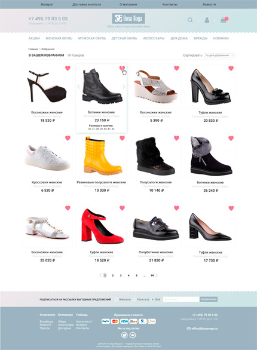](./resources/favourites.png) [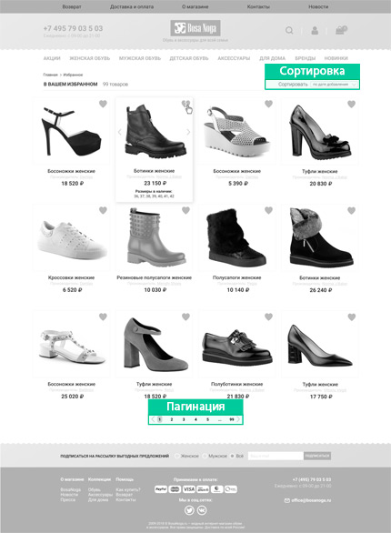](./resources/images/des-fav-full.jpg)

На этом экране отображаются все товары, добавленные пользователем кликом по сердечку. Товары отображаются постранично, на одной странице **12** товаров. Внизу страницы также располагается пагинация.

Доступна сортировка товаров по следующим критериям:
+ По цене;
+ По популярности;

В отношении каждого из товаров доступны возможности:
1. **Убрать товар / товары из Избранного, если он был добавлен ранее**  
Чтобы убрать товар из избранного, нужно повторно кликнуть на сердечко. После этого товар должен исчезнуть со страницы.
2. **Перейти на страницу товара**  
Переход происходит по клику.

Если в избранном нет ни одного товара, блок количества товаров `<span class="amount amount_favorite __web-inspector-hide-shortcut__">` и сортировка `<div class="product-catalogue__sort-by __web-inspector-hide-shortcut__">`должны быть скрыты. Заголовок изменяется на «В вашем избранном пока ничего нет»:

[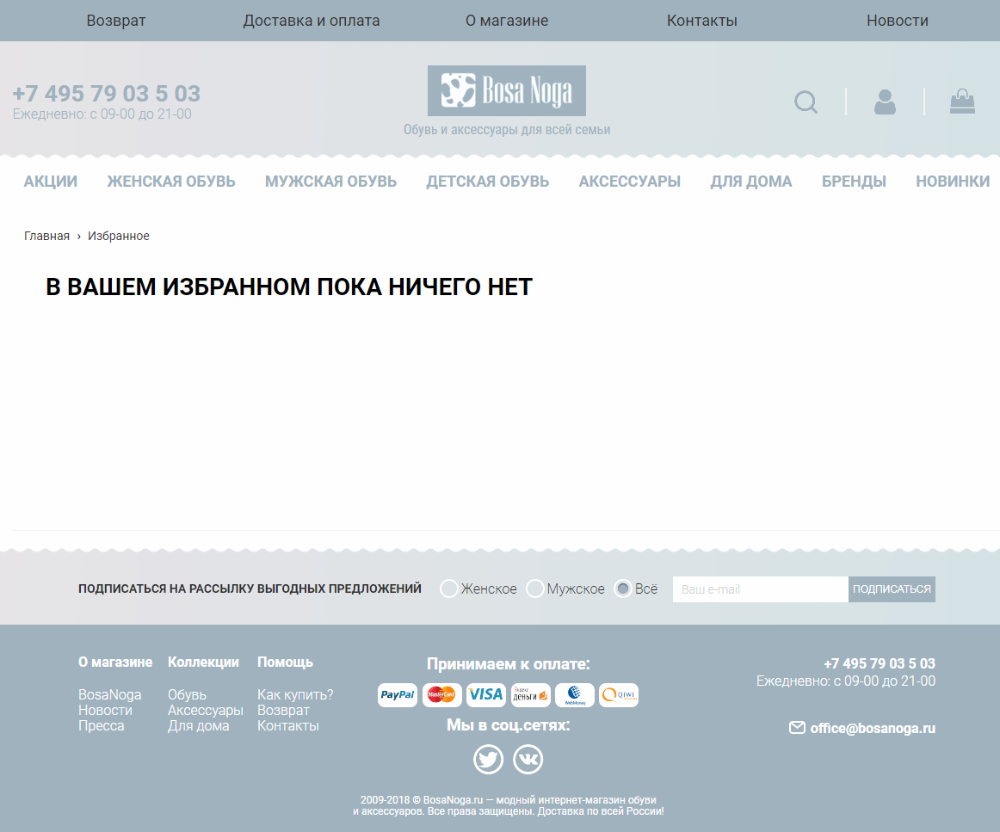](./resources/images/favorite-zero.png)

Футер должен быть прижат к нижнему краю страницы.

### Страница товара

На экран «Страница товара» можно попасть, кликнув на товар в любом из экранов. 

[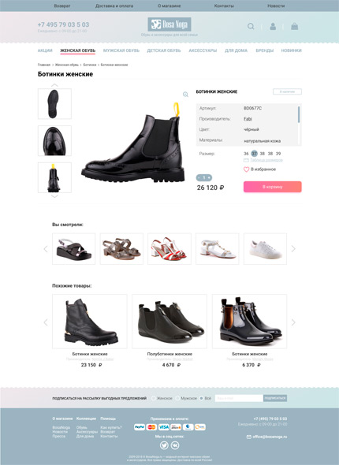](./resources/item.png) [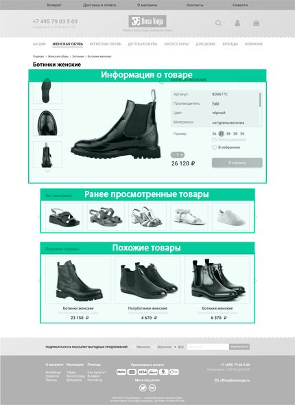](./resources/images/des-item-full.jpg)

Главный блок данного экрана это «Информация о товаре», где отображается подробная информация о товаре, а именно:
1. Фотографии товара в формате галереи.  
Если фотографий 3 или меньше, то стрелочки «Вверх» и «Вниз» в блоке слайдера `<section class="main-screen__favourite-product-slider">` не должны отображаться. Если доступна всего одна фотография товара, то блок `<section class="main-screen__favourite-product-slider">` не отображается.
2. Наименование, Артикул, Производитель, Цвет, Материал, Сезон, Повод.
3. Доступные размеры.
4. Индикатор наличия.

В блоке «Информация о товаре» должны быть доступны следующие возможности:
1. **Добавить товар в Избранное**  
Для добавления нужно кликнуть по кнопке _«В избранное»_ под информацией о товаре. При добавлении сердечко кнопки становится закрашенным, а текст изменяется на _«В избранном»_
2. **Убрать товар из Избранного, если он был добавлен ранее**  
Чтобы убрать товар из избранного, нужно кликнуть по кнопке _«В избранном»_.
3. **Добавить товар в Корзину**  
Для добавления необходимо предварительно выбрать размер и количество товаров. Если размер не выбран, добавление товара в Корзину не происходит, кнопка выглядит неактивной (см. рисунок ниже).
Значения параметров по умолчанию: «Размер» — _нет значения_; Количество товаров — _1_.

[](./resources/disabled.gif)

Сделать кнопку неактивной / активной можно, добавляя и убирая класс `in-basket_disabled`.

При успешном добавлении товара в корзину, в шапке страницы над значком корзины должен появиться счётчик товаров:

[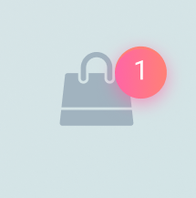](./resources/counter.png)

Появление счетчика должно быть заметным для пользователя. Чтобы привлечь внимание, необходимо реализовать мигание счетчика при каждом его обновлении, показывая и скрывая его несколько раз следующим образом: 

[](./resources/counter-update.gif)

Если при этом страница была проскроллена вниз таким образом, что шапка, а, следовательно, и иконка корзины не видна, следует проскроллить страницу вверх. 

При клике на неактивную кнопку «В корзину», необходимо показать подсказку о необходимости выбора размера, изменив текст кнопки на следующий:

[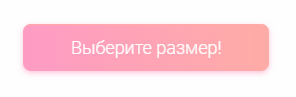](./resources/pick-a-size.png)

После того, как размер выбран, текст кнопки следует изменить обратно на «В корзину», а также сделать её активной.

Кроме информации о выбранном товаре на экране также есть два блока с информацией о других товарах:

1. Блок «Вы смотрели», где выводятся все товары (но не больше 10), страницы которых посетил пользователь во время текущей сессии. Если товаров 5 или меньше, то стрелочки «Назад» и «Вперёд» не отображаются. Если пользователь не смотрел никаких товаров, то блок не отображается. 
2. Блок «Похожие товары», где выводятся товары, чей _Тип_ и _Цвет_ совпадают с _Типом_ и _Цветом_ текущего товара. Если похожих товаров нет, то блок не отображается. Если товаров 3 или меньше, то стрелочки «Назад» и «Вперёд» не отображаются.


### Оформление заказа

На экран «Оформление заказа» можно попасть только из встроенного экрана «Корзина», кликнув по кнопке «Оформить заказ».

[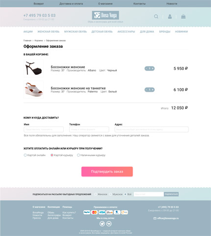](./resources/order.png) [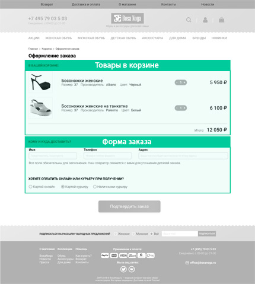](./resources/images/des-order-full.jpg)

На этом экране есть два основных блока:

1. Подробное отображение товаров, добавленных в «Корзину», а именно:
   + Наименование товара;
   + Фотография;
   + Выбранный размер;
   + Производитель;
   + Количество с возможностью его изменить;
   + Цена (изменяется в зависимости от количества).
2. «Форма заказа», в которой есть следующие элементы:
   + Поле для ввода имени покупателя;
   + Поле для ввода телефона;
   + Поле для ввода адреса;
   + Выбор формы оплаты (доступно 3 варианта: Картой онлайн, Картой курьеру, Наличными курьеру)
   + Кнопка подтверждения заказа.

Все поля в Форме заказа являются обязательными для заполнения. До тех пор пока все поля формы не будут корректно заполнены кнопка выглядит неактивной:

[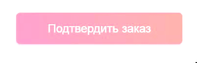](./resources/disabled_order.gif)

Сделать кнопку неактивной / активной можно, добавляя и убирая класс `order-process__form-submit_disabled`.

При успешном подтверждении заказа блоки Корзина и Форма заказа сменяются блоком «Заказ принят, спасибо!». В блоке выводятся следующие данные:
1. Итог заказа:
   + Сумма всего заказа;
   + Выбранный способ оплаты;
   + Имя клиента;
   + Адрес доставки;
   + Телефон
2. Уведомление об отправке копии итога на электронную почту;
3. Предложение продолжить покупки (кнопка, нажатие на которую ведет на страницу Каталога товаров).

### Корзина покупок

Корзина покупок доступна на любом экране и реализуется в виде раздвижной панели в шапке сайта. Отображается по клику на значок корзины:

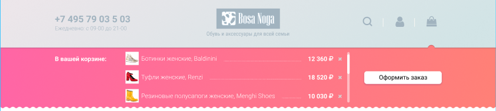

О каждом товаре должна быть отображена следующая информация: Фотография, Наименование товара, Размер, Цена.

```
Рыжики (размер: 12) ..... 4800Р

```

Если в корзину добавлено несколько пар одной и той же обуви разного размера, каждая пара отображается как отдельный товар:

```
Рыжики (размер: 12) ..... 4800Р
Рыжики (размер: 16) ..... 4800Р

```

Если в корзину добавлено несколько пар одной и той же обуви одного и того же размера, следует отобразить количество штук и итоговую цену:

```
Рыжики (размер: 12), 2 шт ..... 9600Р
Рыжики (размер: 16) ........... 4800Р

```

Если в корзину добавлено от одного до трёх товаров, скролл не отображается.

Если в корзине нет товаров, то отображается уведомление «В корзине пока ничего нет. Не знаете, с чего начать? Посмотрите наши новинки!»:


На панели корзины доступны следующие возможности:
1. **Перейти на страницу товара**  
Переход происходит по клику.
2. **Убрать товар из корзины**  
Для этого нужно кликнуть на крестик справа от цены товара.
3. **Оформить заказ**  
Для этого необходимо кликнуть на кнопку «Оформить заказ». При клике происходит переход на экран «Оформление заказа».

### Хлебные крошки

«Хлебные крошки» представлены на экранах «Каталог товаров», «Избранное», «Страница», «Оформление заказа». Данный элемент интерфейса должен отражать местонахождение пользователя в структуре сайта. Например, если пользователь просматривает страницу товара «Туфли принцессы», «хлебные крошки» будут включать ссылки `Главная > Категория > Подкатегория > Наименование товара` и выглядеть следующим образом:

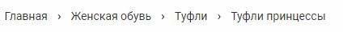

Все ссылки, кроме последней, должны быть кликабельны и вести на соответствующую страницу.

В примере выше клик на ссылку «Туфли» вернет пользователя на страницу каталога, где применён фильтр по типу обуви и выбраны «Туфли». 

Клик на ссылку «Женская обувь» приведёт на страницу каталога женской обуви, где не применены никакие фильтры.

Клик на ссылку «Главная» вернёт на экран «Главная страница».

### Поиск
На сайте должен быть реализован поиск по товарам. Поле для ввода поискового запроса доступно всегда в шапке страницы по клику на иконку в форме лупы. 

Страница вывода результатов поиска представляет собой страницу каталога, где выведены только товары, соответствующие запросу. Все функции страницы каталога (фильтры, сортировка, быстрый просмотр товара, добавление в избранное) доступны на этой странице. Изменяется только заголовок и «хлебные крошки»:

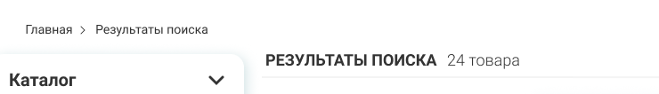

Допускается реализация поиска как «на лету», т.е. сразу же при вводе символов в поле, так и по нажатию на Enter. 

### Подписка
На сайте должна быть реализована подписка на выгодные предложения. Форма подписки доступна всегда в подвале страницы. Пользователь может выбрать между группами предложений (женские, мужские, общие) и оставить свой адрес электронной почты.

После того, как пользователь подписался на предложения, нужно показать уведомление об успешной подписке — «Подписка оформлена! Спасибо!»:


### Прелоадер
Пока приложение ждёт ответа от сервера, должен отображаться прелоадер (`<div class="preloader_wrapper hidden">`). 

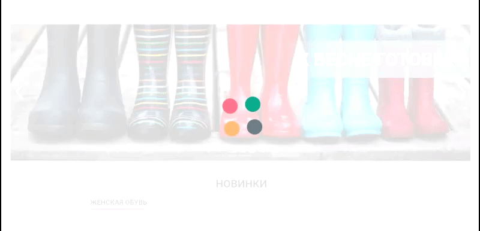

Показать / скрыть прелоадер можно, убирая и добавляя класс `hidden` у блока.

### Состояния
Все активные элементы должны изменять свой внешний вид в зависимости от состояния срабатывания. В случае необходимости пользователь должен быть проинформирован о необходимости сделать определенное действие для изменения текущего состояния элемента. 

## Рекомендации по технической реализации

### Фильтры

Выбранные пользователем фильтры хранятся в состоянии приложения. При запросе списка товаров используются выбранные фильтры.

### Корзина

При добавлении товара в корзину в `localStorage` проверяется наличие идентификатора корзины, если он доступен, то запрос отправляется вместе в ним. В противном случае запрос отправляется без идентификатора, полученный ответ сохраняется в `localStorage`.

### Избранное

Список идентификаторов избранных товаров хранится в `localStorage`.

## Взаимодействие с сервером по HTTP

Для взаимодействия с серверной частью приложения вам доступно REST API по адресу:

https://neto-api.herokuapp.com/bosa-noga

### Получение списка категорий

` GET /categories` — получить информацию о категориях в JSON-формате.

В ответ приходит либо сообщение об ошибке, либо JSON-массив со списком категорий. Например:
```json
{
    "data": [
        {
            "id": 12,
            "title": "Мужская обувь"
        },
        {
            "id": 13,
            "title": "Женская обувь"
        }
    ],
    "status": "ok"
}
```

Тут:
- `data` — данные по запросу, _объект_;
- `id` — идентификатор категории на сервере, _число_;
- `title` — название категории, _строка_;
- `status` — статус запроса, _строка_;

Поле `status` может быть `'ok'` и `'error'`. Если состояние `'error'`, то показывается ещё текст с ошибкой в поле `'message'`.

### Получение списка товаров

`GET /products` — получить информацию о товарах в JSON-формате.

В ответ приходит либо сообщение об ошибке, либо JSON-массив со списком из 10 товаров, согласно переданному параметру `page`, например:
```json
{
  "data": [
    {
      "id": 20,
      "categoryId": 13,
      "title": "Кроссовки как у Pharrell Williams",
      "images": [
        "https://neto-api.herokuapp.com/bosa-noga/Chanel-x-Adidas-Originals-NMD-Hu_480x480.jpg?v=1512941013",
        "https://neto-api.herokuapp.com/bosa-noga/5113054-1_1.jpg"
      ],
      "brand": "Chanel",
      "price": 12000,
      "oldPrice": 14000
    },
    {
      "id": 47,
      "categoryId": 13,
      "title": "Рыбацкая сетка",
      "images": [
        "https://neto-api.herokuapp.com/bosa-noga/1519322087_KCP277SUR_S900_E02_G.jpg",
        "https://neto-api.herokuapp.com/bosa-noga/1519322087_KCP277SUR_S900_E03_D.jpg"
      ],
      "brand": "Dior",
      "price": 5000
    }
  ],
  "pagination": {
    "goods": 62,
    "pages": 7,
    "limit": 10,
    "offset": 0
  },
  "status": "Ok"
}
```

Тут:
- `data` — объект с данными о товарах, _объект_;
- `id` — идентификатор товара на сервере, _число_;
- `categoryId` — идентификатор категории, которой принедлежит товар, _число_;
- `title` — название товара, _строка_;
- `images` — список URL-адрес главного изображения товара, по которому оно доступно в сети, _массив_;
- `brand` — производитель, _строка_;
- `price` — цена товара в рублях, _число_;
- `oldPrice` — цена товара в рублях без скидки, _число_, необязательное поле (есть только у товаров, которые продаются по скидке);
- `pagination` — данные о пагинации, _объект_;
- `goods` — общее количество соответствующих фильтру товаров, _число_;
- `pages` — число требуемых страниц для отображения всех товаров, _число_;
- `limit` — количество возвращаемых товаров за один запрос, _число_;
- `offset` — отступ задаваемый параметром `page` в параметрах, _число_;


Данный метод поддерживает сортировку и фильтрацию, формат данных при отправке — `GET-параметры`. Необязательные поля для фильтрации и сортировки:

- `page` — номер страницы (отступ от начала списка товаров), _число_;
- `type` — тип обуви (балетки, босоножки, ботильоны…), _строка_;
- `color` — цвет обуви, _строка_;
- `size` — размер обуви, _число_;
- `heelSize` — размер каблука, _число_;
- `reason` — повод (офис, вечеринка, свадьба), _строка_;
- `season` — сезон, _строка_;
- `brand` — бренд, _строка_;
- `minPrice` — минимальная цена, _число;
- `maxPrice` — максимальная цена, _число;
- `discounted` — наличие скидки, _логическое значение_;
- `categoryId` — идентификатор категории, _число_;
- `sortBy` — поле для сортировки, одно из значений:
  - `price` — сортировка по цене, _строка_;
  - `popularity` — сортировка по популярности, _строка_;

### Получение новинок

`GET /featured` — получить информацию о новинках товаров в JSON-формате.

В ответ приходит либо сообщение об ошибке, либо JSON-массив со списком товаров. Например:
```json
{
  "data": [
    {
      "id": 20,
      "categoryId": 13,
      "title": "Кроссовки как у Pharrell Williams",
      "images": [
        "https://neto-api.herokuapp.com/bosa-noga/Chanel-x-Adidas-Originals-NMD-Hu_480x480.jpg?v=1512941013",
        "https://neto-api.herokuapp.com/bosa-noga/5113054-1_1.jpg"
      ],
      "brand": "Chanel",
      "price": 12000,
      "oldPrice": 14000
    },
    {
      "id": 21,
      "categoryId": 13,
      "title": "Туфли принцессы",
      "images": [
        "https://neto-api.herokuapp.com/bosa-noga/c5e4699d3c9c.jpg",
        "https://neto-api.herokuapp.com/bosa-noga/s800.webp"
      ],
      "brand": "Dolce & Gabbana",
      "price": 3000
    },
  ],
  "status": "ok"
}
```

Структура ответа аналогична таковой при получении списка товаров.

### Получение информации о товаре

`GET /products/${id}` — получить информацию о товаре в JSON-формате. Тут `${id}` — идентификатор товара на сервере.

В ответ приходит либо сообщение об ошибке, либо JSON-объект с данными о товаре. Например:
```json
{
  "data": {
    "id": 25,
    "categoryId": 13,
    "title": "Туфли императрицы",
    "images": [
      "https://neto-api.herokuapp.com/bosa-noga/images5134523.jpg",
      "https://neto-api.herokuapp.com/bosa-noga/dolce-gabbana-red-tufli-3.jpg"
    ],
    "sku": "1000005",
    "brand": "Dolce & Gabbana",
    "color": "Бардо",
    "material": "Ткань",
    "reason": "Высокая мода",
    "season": "Лето",
    "heelSize": 8,
    "price": 15000,
    "sizes": [
      {
        "size": 15,
        "avalible": true
      },
      {
        "size": 18,
        "avalible": false
      }
    ]
  },
    "status": "ok"
}
```

Кроме полей, которые уже были описаны при получении списка товаров, еще некоторые свойства с ключами:
- `images` — URL-адреса изображений товара, по которому они доступны в сети, первое изображение считается главным, _массив строк_;
- `color` — цвет товара, _строка_;
- `material` — материал, из которого произведен товар, _строка_;
- `reason` — повод, по которому предполагается носить товар, _строка_;
- `season` — сезон, для которого подходит товар, _строка_;
- `heelSize` — размер каблука, _число_ сантиметров;
- `sizes` — информация о размерах и наличии их на складе, _массив объектов_.

Свойство `sizes`, которое хранит массив объетов со следующими свойствами:
- `size` — размер, _число_;
- `avalible` — доступность размера на складе, _логическое значение_.

### Создание корзины

`POST /cart/` — создать новую корзину.

Формат данных при отправке `json-объект`. Пример запроса:
```json
{
  "id": 42,
  "size": 14,
  "amount": 12
}
```

Тут:
- `id` — идентификатор товара на сервере, _число_;
- `size` — размер выбранного товара, _число_;
- `amount` — количество единиц выбранного товара, _число_;

Указанный товар будет добавлен в корзину.

В ответ приходит либо объект с описанием ошибки, либо идентификатор новой корзины.

```json
{
    "id": "-LGp7nXm_acnkzaFQU4Y",
    "status": "ok"
}
```

### Получение содержимого корзины

`GET /cart/${cartId}` — получить список товаров в корзине. Тут `${cartId}` — идентификатор корзины.

В ответ приходит либо сообщение об ошибке, либо JSON-объект с данными о товарах в корзине.

```json
{
  "data": {
    "id": "-LGp7nXm_acnkzaFQU4Y",
    "products": [
      {
        "id": 42,
        "size": 14,
        "amount": 12
      }
    ]
  },
  "status": "ok"
}
```

Тут:
- `data` — содержимое корзины, _объект_;
- `id` — идентификатор корзины, _строка_;
- `products` — список объектов товаров, _массив_;
- `id` — идентификатор товара на сервере, _число_;
- `size` — размер товара, _число_;
- `amount` — количество товара в корзине, _число_;

### Добавление, обновление и удаление товаров из корзины

`POST /cart/${cartId}` — изменить состав коризны. Тут `${cartId}` — идентификатор корзины.

Формат данных при отправке `json-объект`. Пример запроса:
```json
{
  "id": 1,
  "size": 13,
  "amount": 1
}
```

Тут:
- `id` — идентификатор товара на сервере, _число_;
- `size` — размер товара, _число_;
- `amount` — количество единиц товара, _число_.

Указанный товар будет добавлен в корзину, либо обновлен, если уже существовал. 

Для удаления одного из размеров у выбранного товара необходимо передать поле `amount` равное нулю.

В ответ приходит либо сообщение об ошибке, либо объект обновленной корзины, аналогичный предыдущему.

### Создание заказа

`POST /order` — создать новый заказ.

Формат данных при отправке `json-объект`. Пример запроса:
```json
{
	"name": "Николай",
	"phone": "8  999  495 53 33",
	"address": "ул. Гоголя, 92",
	"paymentType": "onlineCard",
	"cart": "-LGp7nXm_acnkzaFQU4Y"
}
```

Тут:
- `name` — имя заказчика, _строка_;
- `phone` — телефон заказчика, _строка_;
- `address` — адрес заказчика, _стркоа_;
- `paymentType` — способ оплаты, _строка, одно из_:
  - `onlineCard` — картой онлайн, _стркоа_;
  - `offlineCard` — картой при получении _стркоа_;
  - `offlineCash` — наличными при получении; _стркоа_;
- `cart` — идентификатор корзины, _строка_;

В ответ приходит либо сообщение об ошибке, либо JSON-объект с данными о товарах в корзине.

```json
{
  "data": {
    "id": "-LGp7wgmnIez0ZiJtPF3",
    "info": {
      "name": "Николай",
      "phone": "8  999  495 53 33",
      "address": "ул. Гоголя, 92",
      "paymentType": "onlineCard",
      "cart": "-LGp7nXm_acnkzaFQU4Y"
    }
  },
  "status": "ok"
}
```

Тут:
- `data` — содержимое заказа, _объект_;
- `id` — идентификатор созданного заказа, _строка_;
- `info` — список объектов товаров, _массив_;

После оформления заказа корзина удаляется

### Как правильно задавать вопросы дипломному руководителю?

Что следует делать, чтобы все получилось: 
1. Попробовать найти ответ сначала самому в интернете. Ведь, именно это скилл поиска ответов пригодится тебе на первой работе. И только после этого спрашивать дипломного руководителя
2. В одном вопросе должна быть заложена одна проблема 
3. По возможности, прикреплять к вопросу скриншоты и стрелочкой показывать где не получается. Программу для этого можно скачать здесь https://app.prntscr.com/ru/
4. По возможности, задавать вопросы в комментариях к коду. 
5. Начинать работу над дипломом как можно раньше! Чтобы было больше времени на правки. 
6. Делать диплом по-частям, а не все сразу. Иначе, есть шанс, что нужно будет все переделывать :)  

Что следует делать, чтобы ничего не получилось: 
1. Писать вопросы вида “Ничего не работает. Не запускается. Всё сломалось.”
2. Откладывать диплом на потом. 
3. Ждать ответ на свой вопрос моментально. Дипломные руководители - работающие разработчики, которые занимаются, кроме преподавания, своими проектами. Их время ограничено, поэтому постарайтесь задавать правильные вопросы, чтобы получать быстрые ответы! 

